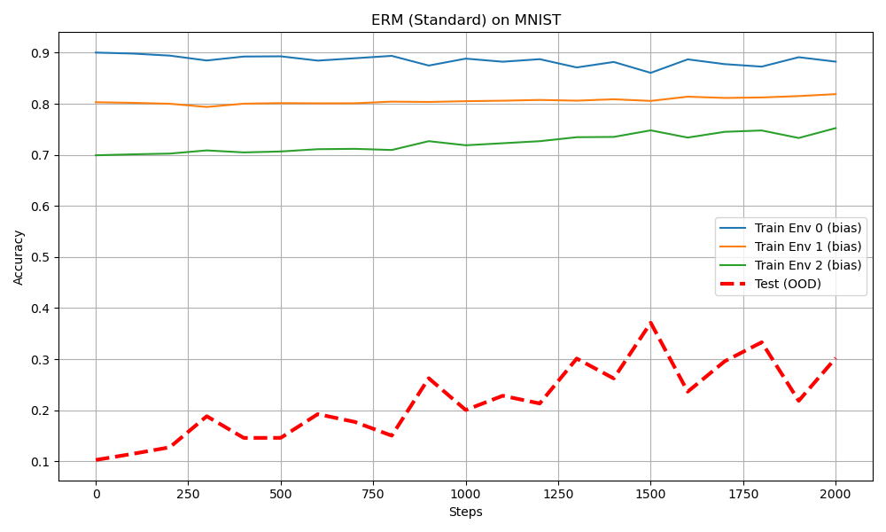
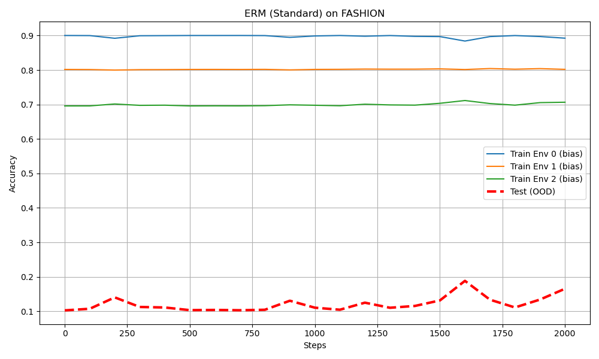
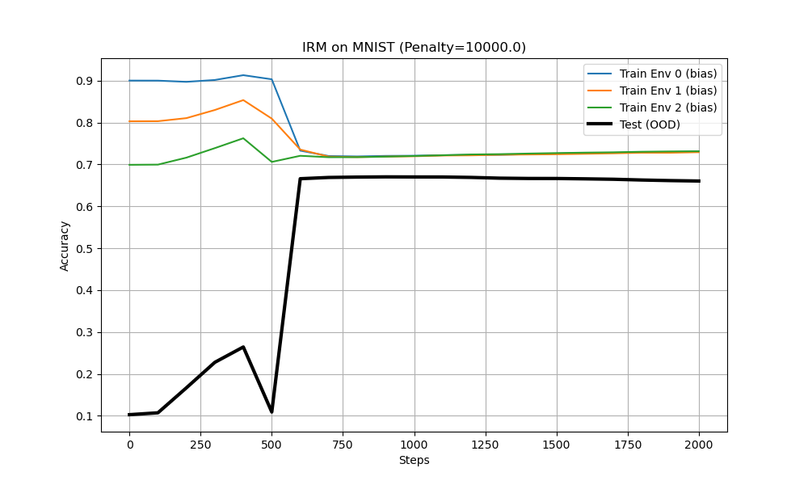
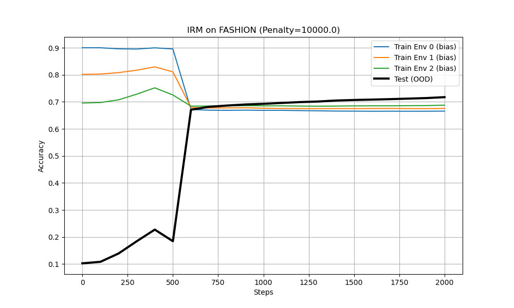

# Invariant Risk Minimization (IRM) vs Empirical Risk Minimization (ERM)

This project demonstrates the difference between **ERM** (Empirical Risk Minimization) and **IRM** (Invariant Risk Minimization) using a synthetic version of the **Colored MNIST** dataset. It follows the approach proposed in the paper [Invariant Risk Minimization](https://arxiv.org/abs/1907.02893).

## Objective

To show how IRM can improve **out-of-distribution (OOD) generalization** compared to ERM, especially when training data contains **spurious correlations** that do not hold in the test environment.

---

## Project Structure

IRM/

├── colored_mnist.py # Generates Colored MNIST environments

├── colored_fashion_mnist.py # Generates Colored Fashion MNIST environments

├── model.py # Simple MLP classifier

├── train_erm.py # Standard ERM training

├── train_irm.py # IRM training with penalty

├── requirements.txt # Required Python packages

└── README.md # Project instructions and description

---

## Installation

### 1. Clone the repository

bash
git clone https://github.com/yourusername/IRM.git
cd IRM

### 2. Install dependencies

pip install -r requirements.txt
 
---

## Running the Experiments
Train with ERM:
python train_erm.py --dataset mnist
python train_erm.py --dataset fashion

Train with IRM:
python train_irm.py --dataset mnist
python train_irm.py --dataset fashion

---

### Experimental Results

This project compares the performance of ERM and IRM across two datasets: **Colored MNIST** (Digits) and **Colored Fashion MNIST** (Clothing).

### 1. The Failure of ERM (Standard Training)
The standard Empirical Risk Minimization (ERM) model seeks to minimize average error. It latches onto the **spurious correlation** (color) because it is the easiest signal to learn during training.

* **Behavior:** High accuracy in training environments (bias accepted), but catastrophic failure in the test environment (OOD), reaching only ~10-20% accuracy (worse than random guessing).
* **Conclusion:** The model memorized the color bias instead of learning the object's shape.

| MNIST (Digits) | Fashion MNIST (Clothing) |
| :---: | :---: |
|  |  |

---

### 2. The Success of IRM
Invariant Risk Minimization (IRM) applies a penalty when the model's predictions depend on unstable factors (like color) that vary across environments.

* **The Turning Point (Step 500):** At step 500, the IRM penalty is activated. The model is forced to "unlearn" the color bias.
* **Result:** While training accuracy drops slightly (as the cheat is removed), the test accuracy (thick black line) improves drastically, stabilizing around ~70% (the theoretical maximum given the label noise).
* **Conclusion:** IRM successfully learns the **causal structure** (the shape), ignoring the misleading context.

| MNIST (Digits) | Fashion MNIST (Clothing) |
| :---: | :---: |
|  |  |

> **Note:** The robustness of IRM proves consistent for both simple shapes (digits) and complex objects (clothing), demonstrating the method's ability to generalize Out-of-Distribution.

---

## References

Arjovsky, M., Bottou, L., Gulrajani, I., & Lopez-Paz, D. (2019).
Invariant Risk Minimization
