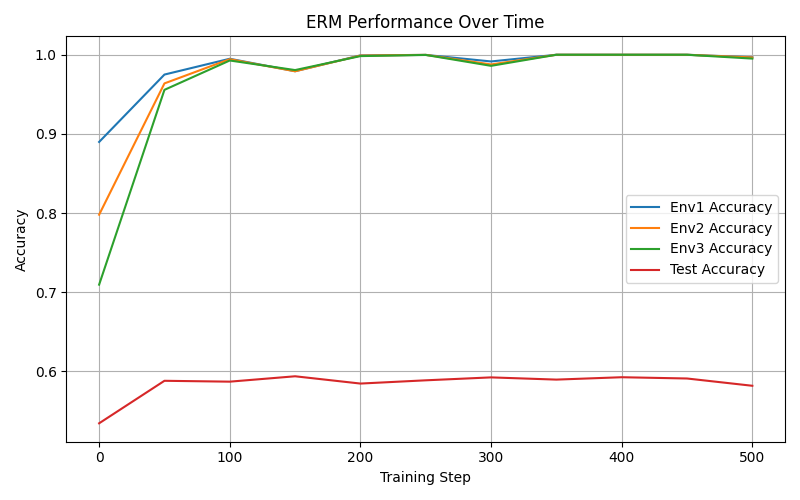
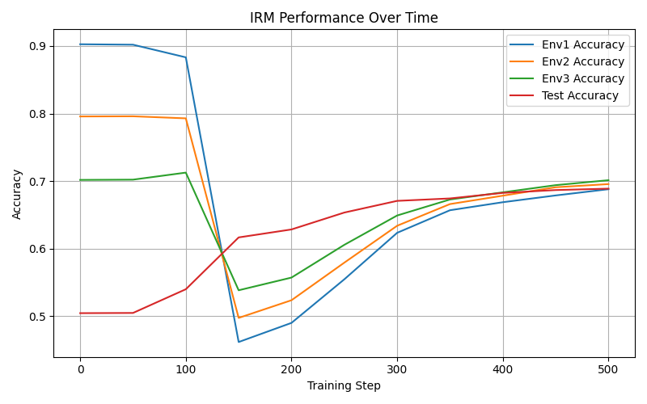

# Invariant Risk Minimization (IRM) vs Empirical Risk Minimization (ERM)

This project demonstrates the difference between **ERM** (Empirical Risk Minimization) and **IRM** (Invariant Risk Minimization) using a synthetic version of the **Colored MNIST** dataset. It follows the approach proposed in the paper [Invariant Risk Minimization](https://arxiv.org/abs/1907.02893).

## Objective

To show how IRM can improve **out-of-distribution (OOD) generalization** compared to ERM, especially when training data contains **spurious correlations** that do not hold in the test environment.

---

## Project Structure

irm-demo/

├── colored_mnist.py # Generates Colored MNIST environments

├── model.py # Simple MLP classifier

├── train_erm.py # Standard ERM training

├── train_irm.py # (To be implemented) IRM training with penalty

├── requirements.txt # Required Python packages

└── README.md # Project instructions and description

---

## Installation

### 1. Clone the repository

bash
git clone [https://github.com/yourusername/irm-demo.git](https://github.com/isabelbr00/IRM.git)
cd irm-demo

### 2. Install dependencies

pip install -r requirements.txt
 
---

## Running the Experiments
Train with ERM:
python train_erm.py

Train with IRM:
python train_irm.py

---

## Experimental Results

### Empirical Risk Minimization (ERM)
The ERM model learns the spurious correlation (color) and fails on the test set.

### Invariant Risk Minimization (IRM)
The IRM model focuses on invariance and maintains stable performance on the test set.

---

## References

Arjovsky, M., Bottou, L., Gulrajani, I., & Lopez-Paz, D. (2019).
Invariant Risk Minimization
